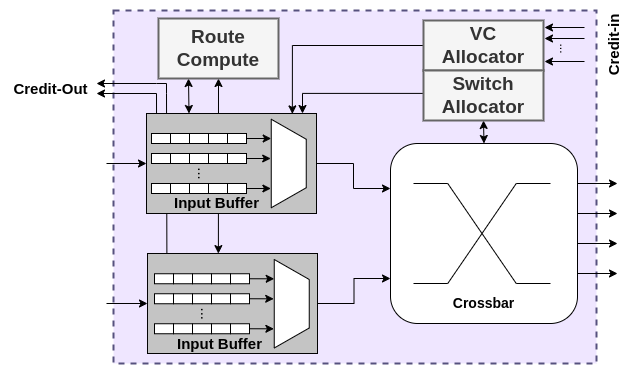
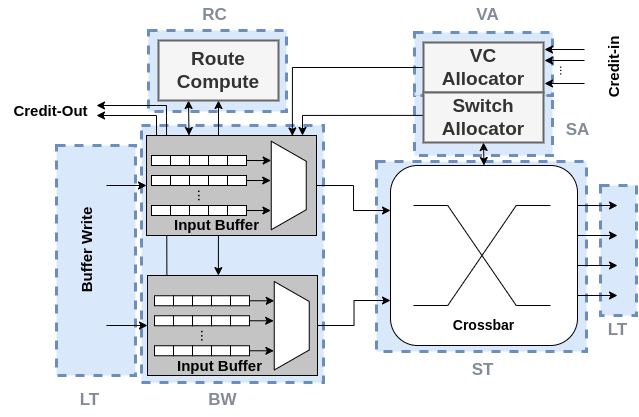
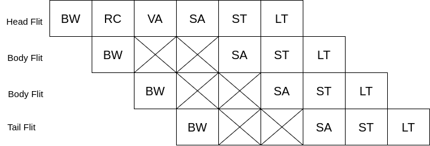
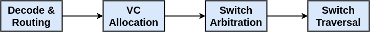
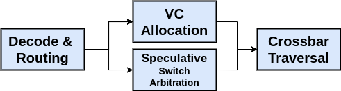
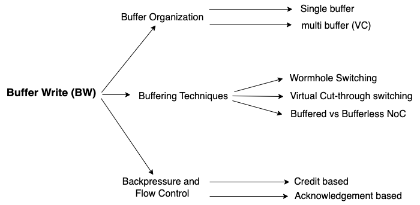
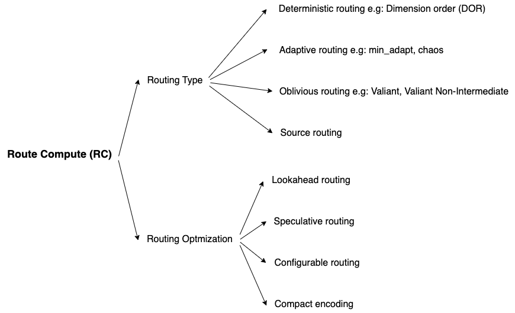

In any modern Network-on-Chip (NoC), communication between cores or chiplets happens via routers connected through links. Just like CPUs use pipelines to move instructions efficiently through execution stages,
NoC routers use pipelines to move packets (or flits) through different processing stages. Thus, the NoC pipeline refers to the sequence of stages that a flit (the unit of network data, a flow control digit) passes through inside a router during its traversal from input port to output port.
Each pipeline stage performs part of the work needed to move the flit forward. The Classic NoC Pipeline Stages at the microarchitectural level are:

1) **Flit buffering (BW)**
2) **Route Compute (RC)**: This stage figures out where the packet should go next, based on the destination address inside the flit header. Typically, this stage uses routing algorithms like XY routing, dimension order routing, etc.
3) **Virtual Channel Allocation (VA)**: This stage decides which VC at the input port the flit can use. In essence, VCs prevent deadlocks and allow mulitple logical flows to share a physical link, thereby reducingthe chance of occurring Head of Line (HoL) blocking inside the crossbar.
In simple terms, after computing the route of the flit, the current router should make sure that the next hop router has available slot to accommodate the current flit. This is the responsibility of this stage.
4) **Switch Allocation (SA)**: This stage grants access to flits who want to enter the crossbar switch. If multiple flits want the same output port at the same time, arbitration decides who wins., and losers stay buffered and retry in the next cycles.
5) **Switch Traversal (ST)**: The step in which the designated flit moves physically across the crossbar from its input port to the output port.
6) **Link Traversal (LT)**: The step in which the designated flit moves onto the outgoing wire/link toward the next router.

Each of these stages typically takes one clock cycle in a simple design. Thus, moving one flit across one hop can take at least 6 cycles in which the first 5 cycles belong to the router itself, and the last cycle belongs to the link.

Modern designs often optimize or collapse stages to reduce latency. For example, VA and SA combined in a single cycle (VA/SA fusion), adding bypass paths for low-contention flits and Speculative switch traversal.
These optimizations aim to cut router pipeline latency to 2–3 cycles or even fewer when conditions allow. Below diagram shows the stages 

The pipeline schema is based on Wormhole routing, where a packet can be broken down into 2 or more number of flits, and each flit undergoes every stage per cycle. As can bee seen in below pipeline diagram,
for every packet, only head flit undergoes Route Computation and Virtual Channel Allocation stages, and the rest of the flits should wait until the head flit finishes Switch Allocation stage.
So, **Router Computation and Virtual Channel Allocation are performed once per packet**.

It is very important to note, however, that, stages are dependent to each other in a specific way. For example, VC allocation stage is dependent only the head flit is decoded and the routing computation is finished, and the destination
of the flit is already known by that time. Otherwise, VC allocation cannot perform. If flit decoding and Route Computation is done and the router makes sure there is an empty buffer in the destination VC, then
the current router participate in Switch Allocation/Arbitration stage. And finally, once Switch Arbitration stage is done, then Switch/Crossbar Traversal gets performed. 
Therefore, we can claim that below chain is the critical path for every router with virtual channel based routing architecture.

As further improvement, a mechanism called **Lookahead Routing** is proposed to perform routing computation for the next router. According to below diagram, VC allocation and switch arbitration can be done in parallel.
This mechanism performs well in low and moderate traffic load, where there are enough buffers in the downstream router such that the VC allocation is successful for most of the time, therefore,
VC allocation and Switch arbitration can be done in parallel. 

I aim to explain the terminology of NoC from the lens of NoC pipeline.

1. Butter Write (BW): 
In the Buffer Write stage, incoming flits (small units of a packet) arriving at a router are stored temporarily in input buffers. This buffering ensures that if the output port is busy or congested, the flits have a safe place to wait before proceeding to the next router stage. Each input port of a router typically has an associated buffer. When a flit arrives, it is placed into the buffer linked to the input port. Sometimes, buffers are further partitioned into Virtual Channels (VCs) to support multiple logical flows and avoid deadlocks. There are two key buffering strategies: Wormhole and Virtual Cut-Through Switching. Essentially, every packet is divided into flits: head, a few body and tail. Only the head flit needs to be routed; body and tail automatically follow. The current router checks the next hop buffer to see if it can occupy at least one flit. If so, it sends flits one by one until either all flits are sent or the next hop buffer gets filled. In this situation, some of the flits reside in one router and some other reside in another one. If the head flit is blocked (cannot advance), the entire packet stalls across multiple routers, with flits spread along the path. On the other hand, Virtual Cut-Through (VCT) checks the downstream router if it has buffer occupancy for the entire flits of the packet, and if so, then it sends all flits of the packet. If not, the entire packet stays buffered in the current router until it can move. Furthermore, techniques like credit-based flow control ensure that a router only sends flits when downstream routers have buffer space available. Some extreme designs eliminate buffers entirely for energy savings, using techniques like deflection routing — but at a cost to latency and reliability.

2. Route Computation (RC): 
The Route Compute stage is responsible for deciding the output port that a packet's head flit should take to move toward its destination. It answers the question: "Where do I send this packet next?" When a head flit reaches a router, it contains the destination address (often encoded in the packet header). The router computes which output port (e.g., North, South, East, West, Local) should be used to get closer to the destination. After computing, RC updates local registers inside the input port of the router about the output port to which the designated flits are supposed to be sent. At the broadest level, routing strategies can be classified into deterministic, oblivious, and adaptive types, each with distinct behaviors and trade-offs. Deterministic routing follows a strictly predefined path between any source and destination. There is no deviation based on network conditions or congestion. The most classic form of deterministic routing is Dimension-Order Routing (DOR), commonly known through examples like XY routing in mesh topologies. In DOR, a packet traverses the network by completely moving along one dimension (such as X) before moving along the next (such as Y). This method guarantees simplicity and deadlock freedom but offers no adaptability to changing network conditions. A slight variation is Dimension-Order Balanced (DO_Bal) routing, which still adheres to the dimension order principles but introduces a simple balancing mechanism when multiple minimal output ports are available. Although DO_Bal remains deterministic at its core, it tries to distribute traffic more evenly across available links without actively reacting to congestion. On the other hand, oblivious routing introduces randomness into the path selection process. Packets are not bound to a fixed route, but they also do not consider the current state of the network. A prime example is Valiant routing, where a packet first travels to a randomly chosen intermediate node before proceeding to its final destination. This two-phase journey helps in balancing the load across the network, significantly reducing the likelihood of creating hotspots even under non-uniform traffic patterns. However, because it disregards actual network congestion, it can sometimes lead to longer-than-necessary paths. An enhancement of this idea is Valiant_NI (Non-Intermediate) routing, where the algorithm intelligently decides whether an intermediate hop is needed based on the proximity of the source and destination. If the nodes are close, it may skip the random detour, achieving better efficiency while still retaining the beneficial load-balancing behavior. Moving beyond obliviousness, adaptive routing introduces the capability to make routing decisions based on the real-time state of the network. Minimal adaptive routing, such as the Min_Adapt algorithm, strives to maintain the shortest possible path (minimal distance) while allowing flexibility among multiple minimal options. If a preferred link is congested, an alternate minimal path can be chosen, thus improving network performance under dynamic workloads without unnecessarily increasing path length. This balance between minimality and adaptivity makes it very attractive for systems where latency and throughput are critical. Pushing adaptivity to its extreme, fully adaptive routing techniques, like the Chaos algorithm, abandon strict path selection altogether. In Chaos routing, packets move opportunistically toward the destination by seizing any available link at each hop, without necessarily staying on a minimal path. This behavior makes the network highly resilient to congestion and faults, as packets are free to detour around busy areas. However, it also requires more complex hardware to manage packet forwarding, buffering, and ordering, and may introduce longer paths compared to minimal strategies.
While routing types define the fundamental behavior of packet movement in a Network-on-Chip, routing optimizations take that foundation and enhance it to achieve greater performance, efficiency, and adaptability. Routing, at its core, is no longer just about choosing a direction; it becomes a finely tuned orchestration to minimize delay, power, and silicon cost, all while maximizing throughput and robustness. One of the earliest and most powerful optimizations is **lookahead routing**, a technique that accelerates routing decisions by computing the next hop’s output port in advance — typically at the preceding router. Instead of waiting until a flit physically arrives to determine its next move, the decision is embedded within the flit ahead of time. This seemingly simple shift allows routers to bypass the traditional Route Compute stage for incoming flits, dramatically reducing per-hop latency. Lookahead routing aligns most naturally with deterministic and oblivious routing types, where the packet’s path can be predicted without depending on live network conditions. In adaptive routing, where congestion must be assessed at each hop, lookahead becomes trickier to apply effectively, although clever hybrid approaches exist. Complementing this, **speculative routing** pushes performance even further by overlapping multiple pipeline stages. Instead of proceeding sequentially — first route computation, then virtual channel allocation, and finally switch allocation — speculative routers make educated guesses, assuming that resource requests will succeed. This speculative execution allows multiple operations to be launched in parallel, slicing away critical path delays. Naturally, speculation works best when routing decisions are predictable, such as in deterministic or oblivious schemes. In adaptive environments, speculation becomes riskier, as congestion or faults can invalidate assumptions, requiring correction mechanisms that complicate router design. Beyond performance, the dynamic nature of workloads and silicon defects in large chips demand routing that can adapt over time. Here, **configurable routing** shines. Instead of hardwiring a single routing algorithm into silicon, configurable routers rely on programmable tables or control logic that can be modified at runtime. This enables the NoC to reroute around faults, rebalance traffic hotspots, or tailor routing strategies to specific applications. Configurable routing aligns most naturally with adaptive routing principles, but it can enhance any routing type by adding flexibility without sacrificing the basic structure. Finally, optimization must consider not only speed and flexibility but also efficiency. **Compact routing** addresses this by reducing the complexity and size of the routing logic itself. By minimizing the amount of information needed for decisions — for example, using simple coordinate deltas or compressed lookup tables — routers consume less area and power, critical factors in NoC scalability.

3. VC Allocation (VA): At a high level, the Virtual Channel Allocation (VA) stage decides which Virtual Channel (VC) an incoming packet or flit will use at the output port of the router. This solves critical problems like deadlock avoidance, head-of-line (HoL) blocking reduction, and better link utilization.
The VA stage is crucial because only one flit can physically leave through an output port per cycle, but many flits may want to — each on different virtual channels. Thus, the VA stage handles the contention among multiple packets/flits competing for VCs at a given output port.
When a head flit reaches the router, It already knows the desired output port from the Route Compute (RC) stage. The router checks which VCs are available on that output port. If multiple packets request VCs at the same time, the router performs arbitration to choose one winner per VC.
The flit is assigned a VC at the output, allowing it to compete later in Switch Allocation (SA). Non-head flits automatically inherit the VC allocated to the head flit — they don't redo VA. Depending on router design, VC Allocation can follow different strategies such as
First-Come, First-Served (FCFS), Round-Robin Arbitration, Priority-Based Arbitration and Oldest-First Arbitration

4. Switch Allocation (SA): This is where real competition happens — packets are ready to move, and now it’s a matter of who wins access to the switch fabric. Once a flit has been buffered (Buffer Write), routed (Route Compute), and granted a virtual channel (VC Allocation), it needs to physically move from its input port to its assigned output port — through the router’s crossbar switch. But here's the challenge: Multiple flits from different input ports may all want to go to the same output port at the same time. The Switch Allocation stage (SA) performs arbitration among these competing flits and determines who gets to use the switch crossbar for the next clock cycle. Arbitration is at the heart of SA. Common strategies include Round-Robin Arbitration, Priority-Based Arbitration, Age-Based Arbitration, Criticality-Aware Arbitration. These arbitration policies are typically implemented in parallel for all output ports to maintain single-cycle operation.    