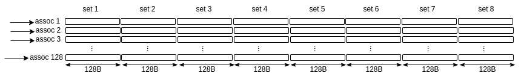

This report captures the detailed discussion and conclusions about the L1 data cache microarchitecture of modern GPUs like NVIDIA Hopper, focusing specifically on:

- The unified shared memory and L1 data cache model

- Associativity adaptation based on shared memory usage

- Configuration logic in simulation models

Modern GPUs like NVIDIA Hopper implement a unified memory block within each SM. This block is shared between **L1 data cache** and **Shared memory**. In AccelSim simulator, the configuration block for adaptive L1 is as below:

| config | Value | Description |
| --- | --- | --- |
| gpgpu_adaptive_cache_config | 1 |  |
| gpgpu_shmem_option | 0,8,16,32,64,100 | units are in KB |
| gpgpu_unified_l1d_size | 128 | unit is in KB |
| gpgpu_l1_banks | 4 | handle at max l1_banks reqs per cycle |
| gpgpu_cache:dl1 | S:8:128:128,L:T:m:L:L,A:384:48,16:0,32 |  |
| gpgpu_shmem_size | 32768 | Size of shared memory per SIMT core |

According to the above configuration, to understand the dynamics of the L1 architecure, we initially focus on **gpgpu_adaptive_cache_config**, **gpgpu_shmem_option** and **gpgpu_unified_l1d_size**. 

1) The total unified capacity for both L1 and shared memory is 128 KB (gpgpu_unified_l1d_size). If the adaptive cache configuration is enabled (gpgpu_adaptive_cache_config), the simulator looks for the demand of the kernel under execution for the amount of shared memory it needs. This demand falls within
   the values in gpgpu_shmem_option. For example, if a kernel needs 64KB of shared memory, then the simulator breaks down the unified cache into two 64KB, one for shared memory and the other one for L1 data cache.
2) Now we try to understand the gpgpu_cache:dl1 parameter:

| information | destription |
| --- | --- |
| S:8:128:128 | S denotes sector cache config - 8 denotes the number of sets - 128 denotes the cache line size, 128 denotes associativity |
| L:T:m:L:L | L denotes cache line replacement policy (LRU) - T denotes write policy (WRITE_THROUGH) - m denotes allocation policy (ON_MISS) - L denotes write allocation policy (LAZY_FETCH_ON_READ) - L denotes set_index_function (LINEAR_SET_FUNCTION) |
| A:384:48 | A denotes MSHR type (normal cache) - 384 denotes the number of entries for MSHR - 48 denotes maximum MSHR merge capacity |
| 16:0 | 16 denotes miss queue size - 0 denotes fifo entires |
| 32 | 32 denotes L1 data port width |

By default, total cache size is: ``` 8 sets * 128 bytes/line * 128 ways = 131072 bytes = 128 KB```


Now, here is a very tricky part: When the demand of shared memory is greater than 0KB, the code dynamically alters the **associativity** of the L1 cache.
```C
if (adaptive_cache_config && !k.cache_config_set) {      // checks if the unified L1 is adaptive or not
    unsigned total_shmem = kernel_info->smem * result;   // checks the demand of the kernel for shared memory
    assert(total_shmem >= 0 && total_shmem <= shmem_opt_list.back());

    // Unified cache config is in KB. Converting to B
    unsigned total_unified = m_L1D_config.m_unified_cache_size * 1024;

    bool l1d_configured = false;
    unsigned max_assoc = m_L1D_config.get_max_assoc();    // by default, it's 128 according to config file

    for (std::vector<unsigned>::const_iterator it = shmem_opt_list.begin(); it < shmem_opt_list.end(); it++) {  // shmem_opt_list = [ 0,8,16,32,64,100]
      if (total_shmem <= *it) { 
        float l1_ratio = 1 - ((float)*(it) / total_unified);   // calculate the ratio of L1 and shared memory
        assert(0 <= l1_ratio && l1_ratio <= 1);       // make sure the ratio is between 0 and 1
        m_L1D_config.set_assoc(max_assoc * l1_ratio + 0.5f); // round to nearest instead of round down. Re-allocation of the associativity 
        l1d_configured = true;
        break;
      }
    }
```
As a result, if a kernel requires 64KB of shared memory, the above code changes the ```8:128:128``` to ```8:128:64```.

3) gpgpu_l1_banks: To be honest, I don't lke the name of this parameter. It's misleading and/or confusing. Actually this parameter denotes the number of cached lines that can be fetechd from L1 in a single cycle. By default it's 4. And since or L1 cache is sector based and L1 data port width is 32,
   then, in one cycle, at most ```4 * 32B = 128B``` can be fetched.

### 💡 Some Extra Hints

1. **Shared memory options should stay below the unified L1D size.**  
   For example, if `-gpgpu_unified_l1d_size` is set to `128` (KB), then a valid option would be:
   -gpgpu_shmem_option 0,8,16,32,64,100
   This means the **maximum shared memory is 100 KB**, leaving **28 KB** for L1 cache. The **actual amount** of shared memory used will be determined **at runtime**.

2. **`-gpgpu_shmem_size` should be a power of two (in bytes)** and must align with values used in `-gpgpu_shmem_option`.  
For example:  
-gpgpu_shmem_size 32768 # 32 KB
At runtime, based on this size and resource availability, the simulator determines **how much shared memory can be scheduled** on an SM.  
For more details, refer to [`Maximum_Number_CTAs_per_SM.md`](./Maximum_Number_CTAs_per_SM.md).

3. **`-gpgpu_l1_banks` defines the number of banks (i.e., concurrent access channels) for L1 cache.**  
A higher number allows **more concurrent L1 accesses**, which can help reduce bank conflicts and improve performance — but it's also subject to architectural design constraints.
4. **`-gpgpu_shmem_num_banks` sets the number of shared memory banks.**  
This config option is **not present by default** in the `.config` file, but **you can manually add it**.  
If it is not set, the **default value is 16 banks**. Adjusting this may help reduce **shared memory bank conflicts**, especially for memory-intensive workloads.
5- The simulation flag `-gpgpu_shmem_size` **must always be equal to or greater than** the amount of shared memory used by the kernel.

### ❗ Why This Matters

If the specified shared memory size is **less than** what the kernel requires, **no CTA (Cooperative Thread Array)** can be scheduled on any SM (Streaming Multiprocessor). This will cause the simulator to hang or terminate with the following error:
GPGPU-Sim uArch: ERROR ** Kernel requires more resources than shader has.

### ✅ Recommended Action

Ensure that the value for `-gpgpu_shmem_size` meets or exceeds the shared memory declared or required by the CUDA kernel.

For example:
```bash
-gpgpu_shmem_size 49152  # at least 48 KB if your kernel uses that much


